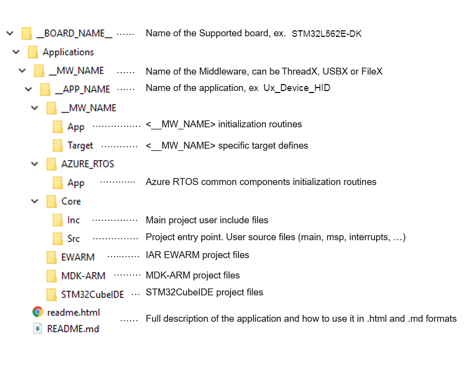

# X-CUBE-AZRTOS-L5 Azure RTOS Software Expansion for STM32Cube

With Azure RTOS complementing the extensive STM32Cube ecosystem providing free development tools, software bricks, and software expansion packages, STM32 users can also leverage the rich services of Azure RTOS, which meet the needs of tiny, smart, connected devices.

**X-CUBE-AZRTOS-L5** (Azure RTOS Software Expansion for STM32Cube) provides a full integration of **Microsoft Azure RTOS** in the STM32Cube environment for the STM32L5 series of microcontrollers. Ready-to-run applicative examples are also provided for the *NUCLEO-L552ZE-Q* and *STM32L562E-DK* evaluation boards, thus **reducing the learning curve** and ensuring a **smooth application development experience** with Azure RTOS and STM32L5 MCUs.

The scope of this package covers the following Azure RTOS middleware: RTOS (***ThreadX***), USB Device and Host (***USBX***), File System including NOR memories support (***FileX*** and ***LevelX***) and Networking (***NetXDuo***).

Azure RTOS is a professional grade, highly reliable and market proven Middleware suite:
 - **Integrated** and full featured **RTOS**. Learn more [_ThreadX_](https://aka.ms/threadx).
 - **Industrial grade** networking stack: optimized for performance coming with **many IoT protocols.** Learn more [_Netx Duo_](https://aka.ms/netxduo)
 - Advanced FS/FTL: **fully featured** to support **NAND/NOR Flash** memories. Learn more [_FileX_](https://aka.ms/filex)  _and_  [_LevelX_](https://docs.microsoft.com/en-us/azure/rtos/levelx/)
 - USB **Host** and **Device** stacks coming with **multiple classes.** Learn more [_USBX_](https://aka.ms/usbx)
 - **Safety pre-certifications (from Microsoft)**: IEC 61508 SIL4, IEC 62304 Class C and ISO 26262 ASIL D
 - **Security pre-certifications (from Microsoft)**: EAL4+ for TLS/DTLS, FIPS 140-2 for SW crypto lib
 - STM32 **granted production license:** [_here_](https://github.com/azure-rtos/threadx/blob/master/LICENSED-HARDWARE.txt)

### Prerequisites
- NetXDuo building require ThreadX as they are based on RTOS model.
- USBX Host MSC requires FileX Middleware usage
- USBX Device ECM/RNDIS classes require NetXDuo usage

One of the following toolchains:

- IAR Embedded Workbench for ARM (EWARM)toolchain 8.50.9 + ST-LINKV2/V3
- [STM32CubeIDE V1.12.0](https://www.st.com/en/development-tools/stm32cubeide.html)  + ST-LINKV2/V3
- RealView Microcontroller Development Kit (MDK-ARM) toolchain V5.37 + ST-LINKV2/V3

## Supported Devices and Boards by Applications
- [NUCLEO-L552ZE-Q](https://www.st.com/en/evaluation-tools/nucleo-l552ze-q.html) *(MB1361C)*
- [STM32L562E-DK](https://www.st.com/en/evaluation-tools/stm32l562e-dk.html) *(MB1373C)*

## Repository structure
The STMicroelectronics GitHub X-CUBE-AZRTOS repository consists of the following repositories:
- **Drivers**: contains STM32L5 CMSIS, HAL and BSP drivers
- **Middlewares**: contains ThreadX, NetX Duo, FileX, LevelX and USBX stacks including porting on STM32 hardware
- **Projects**: provides ready-to-run applicative examples for Azure RTOS on the supported boards. Projects are structured as follows:

## Documentation
More comprehensive documentation is available on STM32 [MCU Wiki](https://wiki.st.com/stm32mcu/wiki/STM32CoreMW_overview).

## License
Azure RTOS is distributed by Microsoft under [GitHub](https://github.com/azure-rtos) and under Microsoft license. 
STMicroelectronics include Azure RTOS in selected STM32Cube software packages, whether delivered by Microsoft under GitHub, or by STMicroelectronics through STM32 CubeFW packages on www.st.com or GitHub, proprietary license terms are the same between Microsoft and User:
-	Source code is available
-	User is granted modification
-	User is granted redistribution of source (modified or not) and/or binary, provided he develops on an MCU/MPU that is listed officially by Microsoft
-	User is granted production, provided he develops on an MCU that is listed officially by Microsoft: [Licensed Hardware](https://github.com/azure-rtos/threadx/blob/master/LICENSED-HARDWARE.txt)
-	User is forbidden to reuse provided software to create a competing offer
Whenever a new STM32 series includes support for Azure RTOS, it is added by Microsoft in the official list

By using STM32L5 Series you inherit the “Distribution and Production Use” rights in Section 2 of the Microsoft Software License Terms for Azure RTOS.

For more details about license information relative to each component in this package, please refer to [LICENSE](./LICENSE.md)

## Release note

Details about the content of this release are available in the release note [here](https://htmlpreview.github.io/?https://github.com/STMicroelectronics/x-cube-azrtos-l5/blob/main/Release_Notes.html).

## Applications

| Middleware   |  Applications                    |       Short Description      |
|--------------|----------------------------------|------------------------------|
|ThreadX       | Tx_Thread_Creation               | It demonstrates how to create and destroy multiple threads using Azure RTOS ThreadX APIs. In addition, it shows how to use preemption threshold between threads and change priorities on-fly. [readme](./Projects/NUCLEO-L552ZE-Q/Applications/ThreadX/Tx_Thread_Creation/README.md) |
|ThreadX | Tx_Thread_Sync                | It demonstrates how to synchronize between threads using binary semaphores or mutexes. [readme](./Projects/NUCLEO-L552ZE-Q/Applications/ThreadX/Tx_Thread_Sync/README.md) |
|ThreadX | Tx_Thread_MsgQueue            | It demonstrates how to exchange message between threads using Message Queue API and how to handle message from different queues using event queue chaining feature. [readme](./Projects/NUCLEO-L552ZE-Q/Applications/ThreadX/Tx_Thread_MsgQueue/README.md) |
|ThreadX       | Tx_LowPower                      | It demonstrates how to configure the LowPower feature of Azure RTOS ThreadX stack. In addition, it shows how to use ThreadX MACRO related to the LowPower feature. [readme](./Projects/NUCLEO-L552ZE-Q/Applications/ThreadX/Tx_LowPower/README.md) |
|ThreadX       | Tx_MPU                           | It demonstrates how to load, start and unload modules. In addition, it shows how ThreadX memory protection on modules using the Memory Protection Unit (MPU). [readme](./Projects/STM32L562E-DK/Applications/ThreadX/Tx_MPU/README.md) |
|ThreadX       | Tx_SecureLEDToggle_TrustZone     | It demonstrates how to develop an application using the ThreadX when the TrustZone feature is enabled (TZEN=1). The application is running ThreadX thread in non-secure context that is invoking a secure function to toggle a led each 1 sec. [readme](./Projects/STM32L562E-DK/Applications/ThreadX/Tx_SecureLEDToggle_TrustZone/README.md) |
|USBX          | Ux_Device_CDC_ACM                | It demonstrates how to develop USB Device communication Class "CDC_ACM" based application. The application is designed to emulate an USB-to-UART bridge following the Virtual COM Port (VCP) implementation, the code provides all required device descriptors framework and associated Class descriptor report to build a compliant USB CDC_ACM device. [readme](./Projects/NUCLEO-L552ZE-Q//Applications/USBX/Ux_Device_CDC_ACM/README.md). |
|USBX          | Ux_Device_HID                    | It demonstrates how to develop USB Device Human Interface "HID" mouse based application. The application is designed to emulate an USB HID mouse device, the code provides all required device descriptors framework and associated Class descriptor report to build a compliant USB HID mouse device. [readme](./Projects/NUCLEO-L552ZE-Q/Applications/USBX/Ux_Device_HID/README.md)  |
|FileX         | Fx_uSD_File_Edit                 | It demonstrates how to develop a basic SD card file operations application. The application is designed to handle SD card insertion/removal events, and depending on that state, it starts and stops file operations from and into the SD card. [readme](./Projects/STM32L562E-DK/Applications/FileX/Fx_uSD_File_Edit/README.md)  |
|FileX         | Fx_NoR_Write_Read_File           | It demonstrates how to create a Fat File system on the NOR flash using FileX alongside LevelX. The application is designed to execute file operations on the MX25LM51245G NOR flash device, the code provides all required software code for properly managing it. [readme](./Projects/STM32L562E-DK/Applications/FileX/Fx_NoR_Write_Read_File/README.md) |
|FileX   | Fx_File_Edit_Standalone       | It demonstrates how to create a Fat File system on the SD card memory using FileX running in standalone mode without ThreadX. [readme](./Projects/STM32L562E-DK/Applications/FileX/Fx_File_Edit_Standalone/README.md) |
|FileX   | Fx_Dual_Instance              | It demonstrates how the coexistence capability of two FileX/LevelX stacks running independently on each core. [readme](./Projects/STM32L562E-DK/Applications/FileX/Fx_Dual_Instance/README.md) |
|FileX   | Fx_MultiAccess                | It demonstrates how the FileX's concurrent file access capabilities. The application is designed to execute file operations on the SD card device, the code provides all required software code for handling SD card I/O operations. [readme](./Projects/STM32L562E-DK/Applications/FileX/Fx_MultiAccess/README.md) |
|USBPD         | USBPD_Sink_Ux_Device_HID_CDC_ACM | It demonstrates how to develop a USBPD type C Consumer and USB Device using Azure RTOS USBX stack on STM32L562E-DK board. [readme](./Projects/STM32L562E-DK/Applications/USBPD/USBPD_Sink_Ux_Device_HID_CDC_ACM/README.md) |
 
## Troubleshooting
**Caution**  : The issues are  **strictly limited**  to submit problems or suggestions related to the software delivered in this repository.

**For any other question**  related to the product, the hardware performance or characteristics, the tools, the environment, you can submit it to the  **ST Community**  on the STM32 MCUs related  [page](https://community.st.com/s/topic/0TO0X000000BSqSWAW/stm32-mcus).

